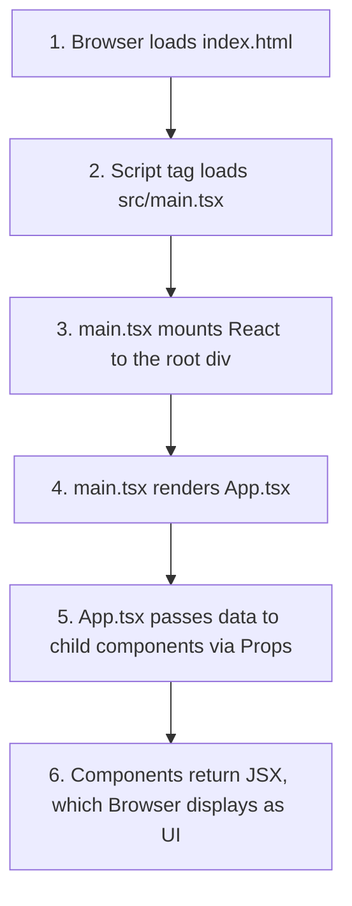

# 🚀 React + TypeScript + Vite: Project Deep-Dive Guide

Welcome! This guide is designed specifically for **beginners** to web technology. It breaks down the folder structure, files, configurations, and core web concepts used in your project folder `1`.

---

## 🛠️ The Tech Stack: The Foundations
Before looking at the folders, let's understand the core tools powering this project:

1. **React**: A popular JavaScript library for building User Interfaces (UI). Instead of writing one massive HTML file, React lets you break your website into small, reusable pieces called **Components** (like a Header, Footer, or Button).
2. **TypeScript (TS/TSX)**: A strict superset of JavaScript. It adds "Types" to your code. For example, if a component expects a `name` which must be a `string` (text), TypeScript will warn you immediately if you try to pass it a `number` (like `123`). This prevents bugs before your code even runs.
3. **Vite**: A modern, ultra-fast build tool and development server. 
   - When you run your site locally, Vite compiles and updates your browser instantly when you save changes (**Hot Module Replacement**).
   - When you are ready to publish, Vite bundles all your code, shrinks it, and compiles it down to standard HTML, CSS, and JS that any browser can understand.

---

## 📂 Project Directory Structure

Here is the complete map of your project folder `1`:

```text
1/
├── node_modules/             # Installed external packages & libraries (Do not edit!)
├── public/                   # Static files served directly (images, icons)
│   ├── favicon.svg           # Tab icon for the browser
│   └── icons.svg             # Icon sprite for vector graphics
├── src/                      # Source code (Where you will write 99% of your code)
│   ├── assets/               # Images and design assets used in components
│   │   ├── hero.png          # Portfolio main illustration
│   │   ├── react.svg         # React logo
│   │   └── vite.svg          # Vite logo
│   ├── components/           # Reusable UI building blocks
│   │   ├── About.tsx         # "About Me" and Education section component
│   │   ├── Footer.tsx        # "Get in touch" and footer component
│   │   ├── Header.tsx        # Navigation bar and Hero banner component
│   │   └── Skills.tsx        # Skills list and progress bars component
│   ├── App.css               # Styling rules specific to the App component
│   ├── App.tsx               # Main component (manages data & coordinates others)
│   ├── index.css             # Global styling rules (fonts, resets, variables)
│   └── main.tsx              # The bootstrap file (connects React to index.html)
├── dist/                     # The output folder created when you run `npm run build`
├── .gitignore                # Lists files Git should ignore (e.g., node_modules)
├── eslint.config.js          # Code-quality tool config (catches styling & logic errors)
├── index.html                # The entry HTML page loaded by the browser
├── package.json              # Project settings, scripts, and dependency list
├── package-lock.json         # Lockfile specifying exact version of dependencies installed
├── tsconfig.json             # Root configuration for TypeScript compiler rules
├── tsconfig.app.json         # TypeScript compiler rules for the application
├── tsconfig.node.json        # TypeScript compiler rules for Vite configuration files
└── vite.config.ts            # Configuration file for the Vite build tool
```

---

## 📑 Detailed Breakdown of Root Files

These configuration files live in the root directory and control how your project builds, checks for errors, and runs.

### 1. `index.html`
Every website needs an HTML file. However, in modern React apps, this file is incredibly simple.
- It contains a single `<div id="root"></div>`. React target-injects your entire application inside this `div`.
- It loads `/src/main.tsx` as a module, which kicks off the JavaScript compilation.

### 2. `package.json`
This is the **heart** of your project settings. It contains:
- **Scripts**: Shortcuts for terminal commands:
  - `npm run dev`: Starts the local development server.
  - `npm run build`: Bundles the code for production.
- **Dependencies**: Libraries required to run the app:
  - `react` and `react-dom`.
- **DevDependencies**: Tools needed only during development (TypeScript, Vite, ESLint).

### 3. `package-lock.json`
This file is generated automatically when you install dependencies. It records the exact version of every single sub-package installed, ensuring that anyone else who runs your code gets the exact same versions, avoiding "it works on my machine" issues. **Never edit this file manually.**

### 4. `vite.config.ts`
Instructs Vite how to compile your project. Here, it is set up to use the React plugin (allowing Vite to build JSX components) and Babel (to optimize the code).

### 5. `tsconfig.json` & `tsconfig.*.json`
Configure **TypeScript** rules:
- `tsconfig.json`: The parent file that references other configurations.
- `tsconfig.app.json`: Configuration for files in `src/` (your actual app).
- `tsconfig.node.json`: Configuration for build-time files (like `vite.config.ts`).

### 6. `.gitignore`
Tells Git (version control) which files **not** to upload to GitHub. For example, it ignores `node_modules` (which are huge and easily re-downloaded) and `dist` (which are rebuilt on demand).

---

## 🗂️ Detailed Breakdown of Folders

### 1. `node_modules/`
This folder contains thousands of folders and files. These are the libraries your project depends on. When you run `npm install`, NPM downloads packages listed in `package.json` and drops them here.
- **Rule**: Do not edit files inside this folder! If you delete this folder, you can restore it instantly by running `npm install`.

### 2. `public/`
Contains files that you want Vite to serve *exactly as they are*. 
- If you place `logo.png` inside `public/`, you can access it in the browser at `http://localhost:5173/logo.png`.
- Currently holds `favicon.svg` (browser tab icon) and `icons.svg`.

### 3. `dist/` (Distribution)
This folder is created only after you run `npm run build`. It contains highly optimized, compressed, and minified HTML, CSS, and JS files. This is the **actual bundle** you upload to web hosting sites (like Vercel, Netlify, or GitHub Pages).

### 4. `src/` (Source)
This is where you write your code. Let's look at it closely.

---

## 💻 Deep Dive: The `src/` Directory

### 🔄 The Execution & Startup Flow (Step-by-Step)
When you run `npm run dev` and open your browser, here is the exact chronological order in which your code runs:



#### 📍 Step 1: Loading the Skeleton (`index.html`)
The browser loads [index.html](file:///d:/SEM-4/PROJECT-ADVWEB/1/index.html) first. It contains:
*   A placeholder target: `<div id="root"></div>`.
*   A script directive: `<script type="module" src="/src/main.tsx"></script>`.

#### 📍 Step 2: Bootstrapping React (`src/main.tsx`)
Because of the script tag, the browser runs **[main.tsx](file:///d:/SEM-4/PROJECT-ADVWEB/1/src/main.tsx)**. This file:
*   Imports the global styles (**[index.css](file:///d:/SEM-4/PROJECT-ADVWEB/1/src/index.css)**) to style the base elements.
*   Imports the main container component **[App.tsx](file:///d:/SEM-4/PROJECT-ADVWEB/1/src/App.tsx)**.
*   Locates the `#root` element in the HTML and injects the `<App />` component into it using:
    ```tsx
    createRoot(document.getElementById('root')!).render(<App />)
    ```

#### 📍 Step 3: Rendering the App Layout (`src/App.tsx`)
**[App.tsx](file:///d:/SEM-4/PROJECT-ADVWEB/1/src/App.tsx)** executes. It:
*   Imports the custom styling stylesheet **[App.css](file:///d:/SEM-4/PROJECT-ADVWEB/1/src/App.css)**.
*   Defines the database object (`studentData`) containing profile details.
*   Imports the child components from the `components/` folder and places them inside the main page layout, passing relevant chunks of information to them.

#### 📍 Step 4: Rendering Child Components (`components/`)
Lastly, the child components load and render their HTML templates based on the data they received:
*   **[Header.tsx](file:///d:/SEM-4/PROJECT-ADVWEB/1/src/components/Header.tsx)** creates the banner.
*   **[About.tsx](file:///d:/SEM-4/PROJECT-ADVWEB/1/src/components/About.tsx)** creates the bio section.
*   **[Skills.tsx](file:///d:/SEM-4/PROJECT-ADVWEB/1/src/components/Skills.tsx)** draws the skill charts.
*   **[Footer.tsx](file:///d:/SEM-4/PROJECT-ADVWEB/1/src/components/Footer.tsx)** adds the contact icons.

---

### 📍 The Entry Point: `main.tsx`
This is the connection point. It does three things:
1. Imports React and React DOM libraries.
2. Imports global styles (`index.css`).
3. Finds the `<div id="root">` inside `index.html` and mounts (renders) your parent React component (`<App />`) inside it.

```tsx
createRoot(document.getElementById('root')!).render(
  <StrictMode>
    <App />
  </StrictMode>,
)
```

---

### 📍 The Control Hub: `App.tsx`
`App.tsx` is the parent component of your application. In your project:
1. It stores a Javascript object called `studentData` representing the portfolio database (profile name, interests, education timeline, skills, and contact URLs).
2. It renders the layout structure of the website.
3. It imports individual components (`Header`, `About`, `Skills`, `Footer`) and passes portions of `studentData` to them using **Props** (Properties).

---

### 📍 The Components Directory: `src/components/`
To keep code clean, the layout is broken into modular chunks:

#### A. `Header.tsx`
- **What it does**: Handles the navigation bar (`About`, `Skills`, `Get in Touch` links) and the giant introductory banner (Hero Section).
- **Props it receives**:
  - `name`: Student's name ("MANAN VASANI").
  - `title`: Job/career title.
  - `tagline`: Bio elevator pitch.

#### B. `About.tsx`
- **What it does**: Displays the professional biography paragraph, a checklist of focus areas (interests), and an education timeline showing university credentials.
- **Props it receives**:
  - `bio`: Text biography.
  - `education`: List of degrees, universities, and years.
  - `interests`: Array of developer interests.

#### C. `Skills.tsx`
- **What it does**: Groups developer skills into categories (Frontend, Backend, Tools) and maps them into interactive percentage indicator bars.
- **Props it receives**:
  - `skills`: An array of objects containing the skill name, category, level, and visual percentage value.

#### D. `Footer.tsx`
- **What it does**: Contains the call-to-action (email link), SVG icons representing social links (GitHub, LinkedIn), and copyright notice.
- **Props it receives**:
  - `email`, `githubUrl`, `linkedinUrl`, `copyright`.

---

## 💡 Important Web Concepts for Beginners

### 1. What are "Props" (Properties)?
In React, **Props** are arguments you pass into components, similar to arguments in JavaScript functions or attributes in HTML tags. They allow components to be dynamic.

For example, in `App.tsx`, we pass the student name down to the `<Header>` component:
```tsx
// Inside App.tsx (Parent)
<Header name={studentData.personal.name} />
```
And inside `Header.tsx` (Child), we accept it:
```tsx
// Inside Header.tsx (Child)
export const Header = ({ name }) => {
  return <h1>Hi, I'm {name}</h1>;
}
```
If you change the name in `App.tsx`, it will automatically update in the Header without modifying `Header.tsx`.

### 2. Component Files: `.tsx` vs `.ts`
- **`.ts` (TypeScript)**: Standard TypeScript files. Used for writing pure logic, helper functions, and settings (e.g., `vite.config.ts`).
- **`.tsx` (TypeScript JSX)**: Files containing React components. The extra `x` stands for **JSX** (JavaScript XML), allowing you to write HTML-like structures directly inside your Javascript code.

### 3. Separation of Styles (`App.css` vs `index.css`)
- **`index.css`**: Global settings. Used for defining color palettes, system fonts, and overall CSS variables (like dark mode styling).
- **`App.css`**: Layout configurations. Contains CSS rules that layout the container classes, button designs, and component positions for your portfolio.

---

## 🏃 How to Run and Edit Your Project

1. **Open the Terminal** in your project directory (`/1`).
2. Run **`npm install`** (only needed the first time to fetch `node_modules`).
3. Run **`npm run dev`** to spin up the local server.
4. Open the local address (usually `http://localhost:5173`) in your web browser.
5. Try editing `App.tsx` (e.g., change the name `"MANAN VASANI"` to something else) and save the file. Notice how the browser updates **instantly** without reloading the page!
