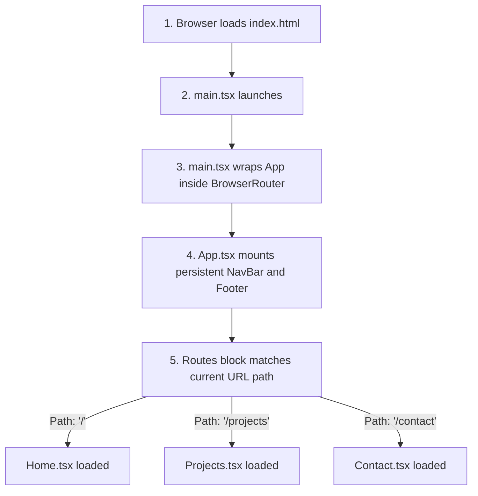

# 🚀 React Router + State Management (Practical 2) - Project Deep-Dive Guide

Welcome to **Practical 2**! This guide describes the architectural and code updates implemented in folder `2`. You'll learn how multi-page routing with **React Router** and state management with **`useState`** hooks are structured.

---

## 🛠️ The Practical 2 Objective & Features

In this project, we extended the base portfolio by:
1.  **Installing React Router (`react-router-dom`)**: Enabling URL-based navigation without page reloads.
2.  **Structuring Page Components**: Breaking the single-page layout into three distinct page files (`src/pages/Home.tsx`, `src/pages/Projects.tsx`, `src/pages/Contact.tsx`).
3.  **Implementing a Navigation Link System**: Customizing navigation to use Router `NavLink` elements that dynamically highlight the active link based on the browser's URL path.
4.  **Managing State with `useState`**:
    *   **Controlled Form**: Built a Contact Form that captures input in real time and renders an instant keystroke preview.
    *   **UI Element Toggle**: Created an interactive guide box that shows/hides dynamically on user click.

---

## 📂 Project Directory Structure

Here is the map of your updated project folder `2`:

```text
2/
├── node_modules/             # External packages (react-router-dom, react, vite)
├── public/                   # Static files (favicons, icon sprite)
├── src/                      # Source Code
│   ├── assets/               # Local dynamic assets (hero.png, logos)
│   ├── components/           # Persistent layout components
│   │   ├── About.tsx         # About Me section layout
│   │   ├── Footer.tsx        # Portfolio footer section
│   │   ├── Header.tsx        # Hero banner with inline themeColor prop
│   │   ├── NavBar.tsx        # Re-built using react-router-dom Link tags
│   │   └── Skills.tsx        # Technical skills chart layout
│   ├── pages/                # Distinct Routed Page Views
│   │   ├── Home.tsx          # Composes Header + About + Skills (Home page)
│   │   ├── Projects.tsx      # Renders projects card catalog (Projects page)
│   │   └── Contact.tsx       # Controlled message form and help tip box (Contact page)
│   ├── App.css               # Main application layout and routing styles
│   ├── App.tsx               # Orchestrates routing nodes via <Routes>
│   ├── index.css             # Global tokens and system resets
│   └── main.tsx              # Wraps the <App /> inside <BrowserRouter>
├── dist/                     # Optimised production bundle (built on compile)
├── index.html                # Entry HTML file
├── package.json              # Contains dependencies (updated with react-router-dom)
└── vite.config.ts            # Vite compiler configurations
```

---

## 📑 Detailed Breakdown of Routing Components

### 🔄 The Startup & Routing Flow

When a user visits your site, the page loads in the following sequence:



#### 1. The Bootstrapper ([main.tsx](file:///d:/SEM-4/PROJECT-ADVWEB/2/src/main.tsx))
To enable routing throughout the application, we import `BrowserRouter` from `react-router-dom` and wrap the `<App />` component:
```tsx
createRoot(document.getElementById('root')!).render(
  <StrictMode>
    <BrowserRouter>
      <App />
    </BrowserRouter>
  </StrictMode>,
)
```

#### 2. The Router Switchboard ([App.tsx](file:///d:/SEM-4/PROJECT-ADVWEB/2/src/App.tsx))
In **[App.tsx](file:///d:/SEM-4/PROJECT-ADVWEB/2/src/App.tsx)**, we import `Routes` and `Route` from `react-router-dom`. The persistent `NavBar` and `Footer` stay outside the `<Routes>` block so they remain on screen at all times. The main content area shifts dynamically based on the URL path:
```tsx
<main>
  <Routes>
    <Route path="/" element={<Home studentData={studentData} />} />
    <Route path="/projects" element={<Projects />} />
    <Route path="/contact" element={<Contact />} />
  </Routes>
</main>
```

---

## 📑 New Page Components in `src/pages/`

### 🏠 1. Home Page ([Home.tsx](file:///d:/SEM-4/PROJECT-ADVWEB/2/src/pages/Home.tsx))
Acts as the landing portal. It composes your existing portfolio components (`Header`, `About`, and `Skills`) into a single-page view. It accepts the `studentData` prop from `App.tsx` and delegates details to the child components.

### 💼 2. Projects Catalog ([Projects.tsx](file:///d:/SEM-4/PROJECT-ADVWEB/2/src/pages/Projects.tsx))
Defines an array of developer projects (such as interactive e-commerce and cryptotracking web apps) and maps them into an elegant grid of cards styled after Apple's minimalist accessory layout.

### ✉️ 3. Contact Form & State Management ([Contact.tsx](file:///d:/SEM-4/PROJECT-ADVWEB/2/src/pages/Contact.tsx))
This component satisfies all Practical 2 state management specifications using two `useState` hooks:

#### A. Controlled Input Form
We bind the `value` of input elements directly to React state:
```tsx
const [formData, setFormData] = useState({ name: '', email: '', message: '' });
```
As you type in the text boxes, the `onChange` event fires, updating the `formData` state. A **Real-Time Input Preview** block reads the active state variables and renders what you type on screen instantly.

#### B. UI Element Visibility Toggle
To demonstrate dynamic UI visibility, we track a boolean state:
```tsx
const [showTooltip, setShowTooltip] = useState(false);
```
Clicking the "Show Guide / Hide Guide" button toggles this boolean, showing or hiding a detailed informational card describing the project requirements.

---

## 💡 Key Lab Concept Answers

### 1. How does React Router prevent full page reloads?
React Router replaces standard HTML `<a>` tags with its custom `<Link>` or `<NavLink>` components. Instead of requesting a new HTML page from a server, React Router intercepts the browser click, updates the address bar URL using HTML5 History API, and mounts/unmounts the matched page components locally inside the browser.

### 2. What are controlled vs. uncontrolled components in React?
*   **Controlled Component**: The form input's value is driven entirely by React state (via the `value` attribute). Any change to the text input goes through an event handler that updates React state, making React the "single source of truth".
*   **Uncontrolled Component**: The input maintains its own internal state using the standard browser DOM. You extract the value using a reference (`ref`) only when needed.

### 3. What is the role of `useState` in React?
`useState` is a React Hook that lets functional components remember data across renders. When a state variable is modified via its setter function, React is notified of the update and automatically triggers a re-render of the component and its children to match the new state values.
